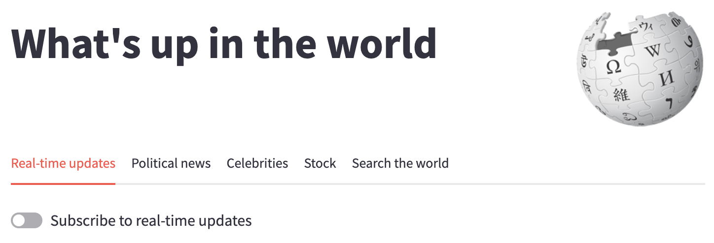
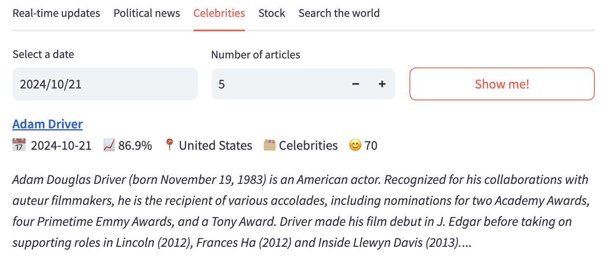
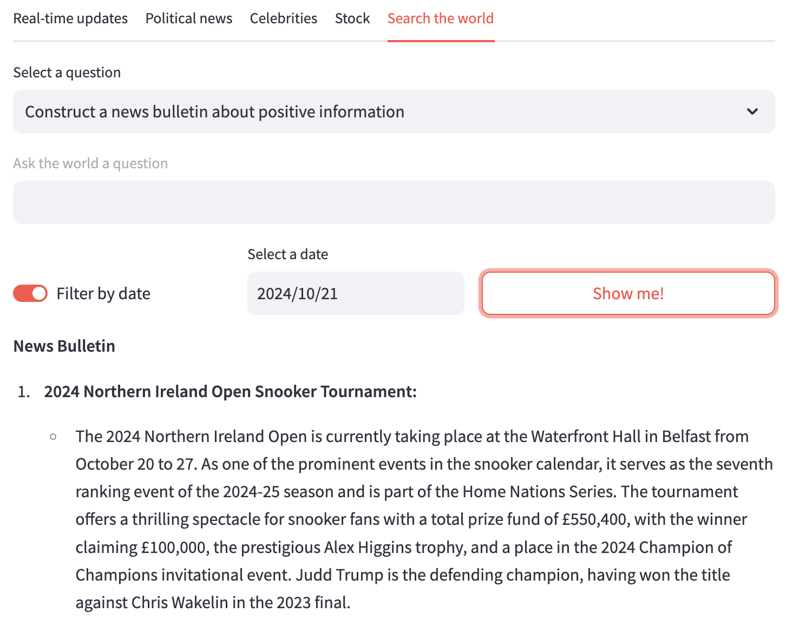
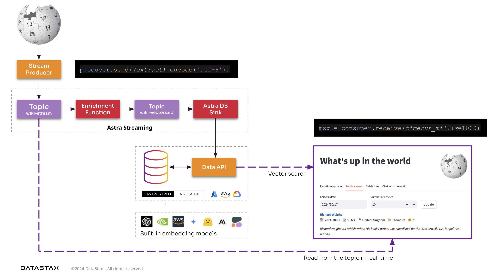
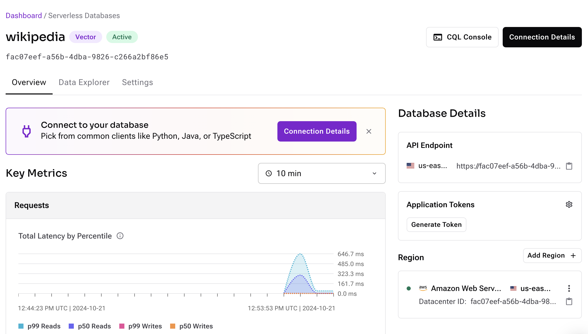
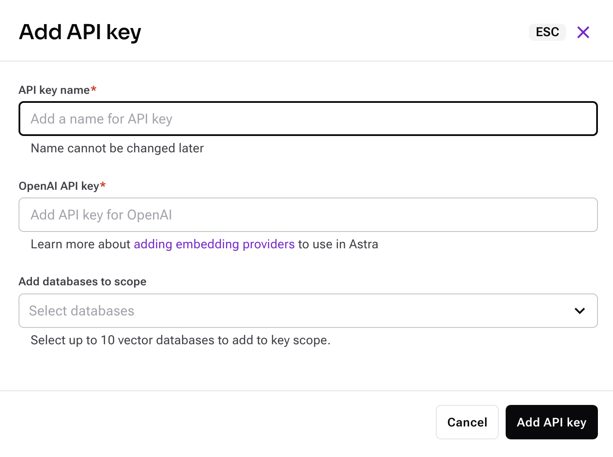
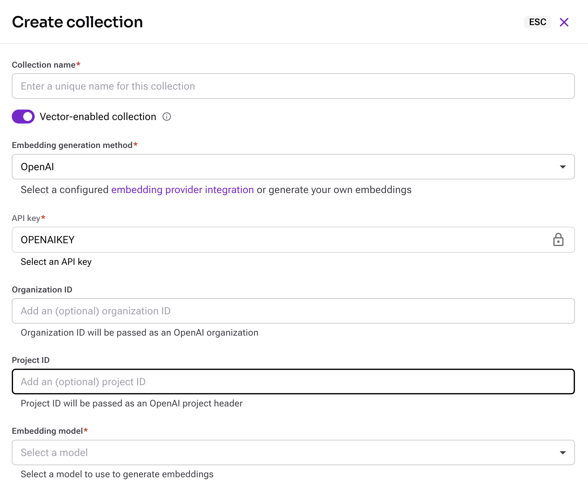
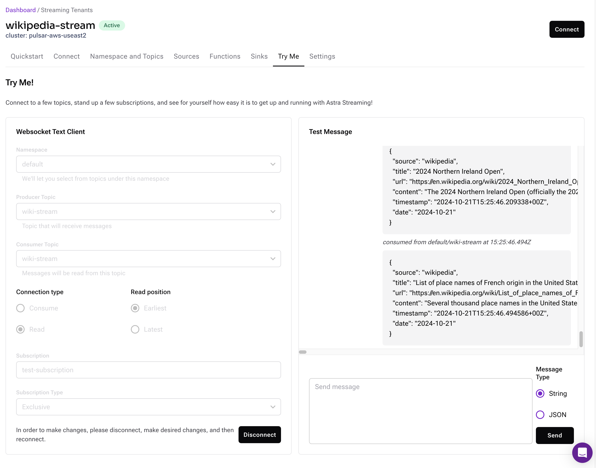
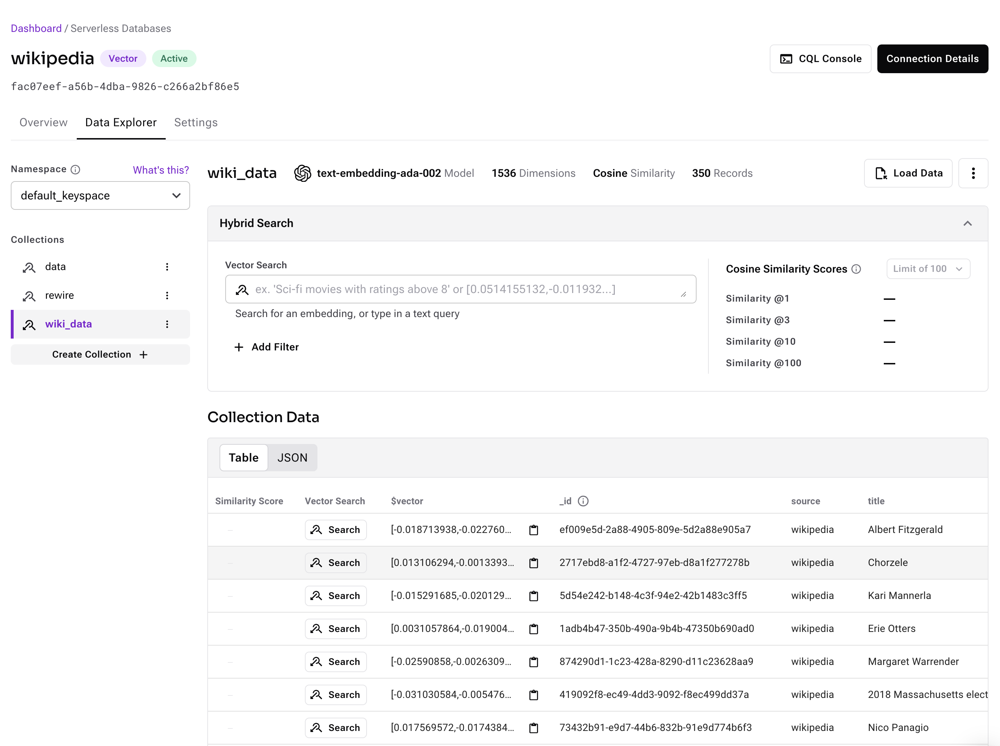
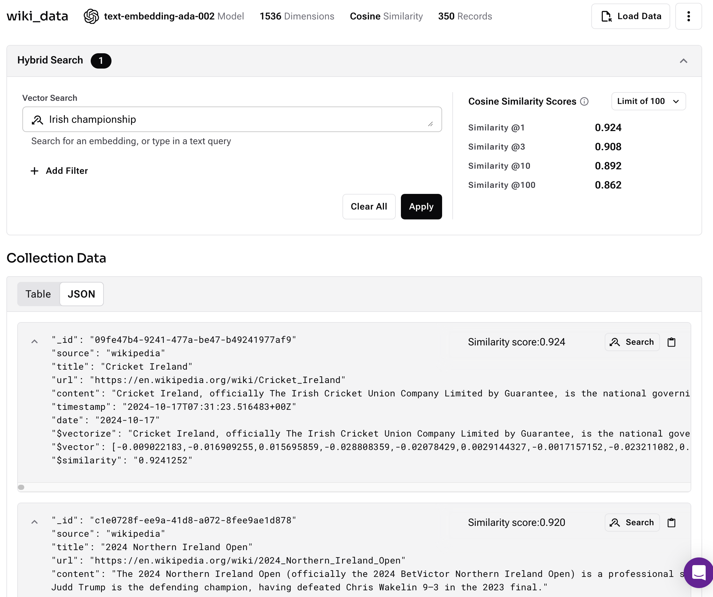

# Enterprise-grade real-time RAG pipeline on Wikipedia
This project is part of the following Github projects:
- [Wikipedia - What's up in the world? (Back-end)](https://github.com/michelderu/wikipedia-pulsar-astra) **(THIS PROJECT)**
- [Wikipedia - What's up in the world? (Front-end)](https://github.com/michelderu/wikipedia-streamlit)

## Introduction
Wikipedia is an amazing source of information 🧠. With all the real-time additions and updates of articles, it's a valuable source of information about what's happening in the world 🌍. Perhaps even faster than the news 📰. And that's what this project is all about: Accessing the most relevant articles from Wikipedia to answer your questions.

Additionally, this project is a good example of how to build a rock-solid, scalable, and performant enterprise architecture 🚀. It makes use of the following technologies:
- [Astra Streaming](https://www.datastax.com/products/datastax-astra-streaming): A fully managed Pulsar as a service that provides a real-time pub-sub messaging platform.
- [Astra DB](https://www.datastax.com/products/datastax-astra-db): A fully managed Cassandra DB as a service.
- [Streamlit](https://streamlit.io/): A Python library for prototyping web apps.

🤩 Notable concepts used in this project are:
- Back-end ⏪
    - Publishing Wikipedia updates in real-time to a Pulsar Topic - Fire and forget with delivery guarantees.
    - [Pulsar Functions](https://pulsar.apache.org/docs/functions-overview/): Enriching the data and JSON structure of the Wikipedia articles.
    - Using a Pulsar Sink (function) to store the data in Astra DB using the Data API.
- Front-end ⏩
    - Using -just- Vector Search to classify data into news topics in real-time with no lag.
    - Using [Instructor](https://github.com/jxnl/instructor) + an LLM to enrich the data further including Sentiment Analysis.
    - Subscribing to the Pulsar Topic showing real-time Wikipedia updates flowing in.
    - [Astra Vector DB](https://docs.datastax.com/en/astra-db-serverless/get-started/concepts.html): A [Forrester Wave Leader](https://www.datastax.com/blog/forrester-wave-names-datastax-leader-vector-databases) in the Vector Database category.
    - [Astra Vectorize](https://docs.datastax.com/en/astra-db-serverless/databases/embedding-generation.html): Auto-generate embeddings with vectorize.
    - Providing a Chat with Wikipedia using an LLM.

## Why is real-time streaming so important?
A lot of people are struggling to make the leap from RAG prototyping to production hardened RAG pipelines. Streaming solves that.
> Streaming provides a no-more-sleepness-nights fire-and-forget way of updating your data.

It provides guarantees for delivery with just 2 lines of code. Additionally, it fully decouples apps and backbones which still keep working if on or the other is temporarily unavailable.

## Screenshots




## The architecture
This application is the back-end for the Wikipedia - What's up in the world? project. It consists of two parts:
1. A [Pulsar Streaming project](https://github.com/michelderu/wikipedia-pulsar-astra) **(THIS PROJECT)** that consists of the following components:
    - A Pulsar producer that produces the Wikipedia articles to a Pulsar topic.
    - A Pulsar function that enriches the Wikipedia articles with and OpenAI LLM.
    - A Pulsar sink that stores the enriched Wikipedia articles in an Astra DB collection.
2. A [Streamlit application](https://github.com/michelderu/wikipedia-streamlit) that allows you to search the Wikipedia articles and chat with the articles.



## Preparations

### Sign up for OpenAI
As we'll be using an OpenAI LLM and Embedding model, you'll need to sign up for an OpenAI account.
- Create an [OpenAI account](https://platform.openai.com/signup) or [sign in](https://platform.openai.com/login).
- Navigate to the [API key page](https://platform.openai.com/account/api-keys) and create a new **Secret Key**, optionally naming the key. Make sure to note it down as you'll need it in the next steps.

🥳 You just created an Open AI API account. 

### Sign up for a DataStax Astra account
If you don't have one already, create a [DataStax Astra account](https://astra.datastax.com/signup?utm_medium=event&utm_source=conference&utm_campaign=MichelRu&utm_content=) or [sign in](https://astra.datastax.com). Please note that when creating an account using a GitHub account, you need to have it set to public.

### Create an Astra database instance
Make sure to create a `Serverless (Vector)` database in the AWS us-east-2 region. Start by clicking on the `Databases` page in the Astra UI and then click on the `Create Database` button.
Just provide the following information:
- Database name: anything memorable (e.g. `wikipedia`)
- Provider: AWS
- Region: us-east-2

*We're using this region because it allows us to use the [Vectorize](https://docs.datastax.com/en/astra-db-serverless/databases/embedding-generation.html) feature.*

Once created, note down the following information:
- API Endpoint
- Application Token (by clicking `Generate Token` button)

🥳 You just created a Vector Database. 



### Enable Vectorize to automatically generate embeddings
Navigate to the `Integrations` page.
- Enable the `OpenAI` intgeration
- Add a notable name for the key you're about to add (e.g. `OPENAI_API_KEY`)
- The OpenAI API Key you created earlier
- And add the database you created earlier to the scope



### Create a collection to store the Wikipedia articles
Navigate back to the database you created earlier
- Click on the `Data Explorer` tab
- Click on the `Create Collection` button
- Give it a notable name (e.g. `wiki_data`)
- Choose OpenAI as the embedding provider
- Make sure the API Key is set to the one you created earlier
- Select `text-embedding-ada-002` as the model
- Leave all other options as is
- Click on the `Create Collection` button



🥳 You're all set for Astra DB. You just created a database and a Vector Search collection that allows for automatically generating embeddings.

### Create a Streaming tenant
Make sure to create a Streaming Tenant in the AWS us-east-2 region. Start by clicking on the `Streaming` page in the Astra UI and then click on the `Create Tenant` button.
Just provide the following information:
- Tenant Name: anything memorable (e.g. `wikipedia`), potentially add your initials to make it unique.
- Provider: AWS
- Region: useast2

Once created, note down the following information:
- On the `Connect` tab, scroll down and note down the `Broker Service URL`.
- Then click on `Token Manager`. On `Token Management`, click on the `Create Token` button and note down the newly created token.

Additionally, click on `Download client.conf` and set the file aside for later use.  
Also, note down the following, as you'll need it in the next steps:
- `brokerServiceUrl` from within the `client.conf` file
- `authParams` from within the `client.conf` file (take only the part after `token:`)

🥳 You just created a Streaming tenant. 

### Create the required Pulsar topics
If not selected already, click on the tenant name you created earlier.
- Click on the `Namespace and Topics` tab
- Click on `Add Topic` next to the `default` namespace
- Provide a topic name called `wiki-stream`
- Enable `Persistent`

Repeat for the following Topic Names:
- wiki-stream-vectorized
- wiki-stream-log

🥳 You just created the required Pulsar topics.

### Get a Pulsar CLI
Download the Pulsar Binaries from the [Pulsar website](https://pulsar.apache.org/download/) and unzip them into the `./pulsar` folder. The [current version is 3.3.2](https://www.apache.org/dyn/closer.lua/pulsar/pulsar-3.3.2/apache-pulsar-3.3.2-bin.tar.gz?action=download) of which `pulsar-admin` works fine with Astra Streaming 2.11

Now extract the binaries by running the following command:
```bash
tar -xzf apache-pulsar-3.3.2-bin.tar.gz
```

> Whenever a Pulsar CLI is called like `bin/pulsar-admin`, it is expected to be run from the just extracted`pulsar` folder.

Now copy the `client.conf` file you downloaded earlier into the `apache-pulsar-3.x.x/conf` folder.

You can test the connection to the Pulsar cluster by running the following command:
```bash
bin/pulsar-admin namespaces list <tenant-name>
```

### Load the Vectorize Function
The vectorize function is already packaged up in a zip-file and available in the `pulsar-functions/vectorize-function` folder.

⚠️ First, copy the `create-config.yaml.example` file to `create-config.yaml`. Then open it and:
- Update the `tenant` and `namespace` to the name of the tenant you created earlier. 
-  `inputs`, `output` and `logTopic` fields to the ones you used earlier.

Second, load the function into Pulsar using the following command:
```bash
bin/pulsar-admin functions create --function-config-file=../pulsar-functions/vectorize-function/create-config.yaml
```

### Load the Astra DB Sink
The Astra DB Sink is already packaged up in a zip-file and available in the `pulsar-functions/ingest-to-astra-function` folder.

⚠️ First, copy the `create-config.yaml.example` file to `create-config.yaml`. Then open it and:
- Update the `tenant` and `namespace` to the name of the tenant you created earlier. 
- Update the `inputs` and `logTopic` fields to the ones you used earlier. There is no 'output' field for this function as the function behaves as a Sink.
- Update the `astra_db_api_endpoint` to the the Astra DB API Endpoint you noted down earlier.
- Update the `astra_db_application_token` to the Astra DB Application Token you noted down earlier.
- Update the `collection` to the name of the collection you created earlier (e.g.: `wiki_data`).

Second, load the function into Pulsar using the following command:
```bash
bin/pulsar-admin functions create --function-config-file=../pulsar-functions/ingest-to-astra-function/create-config.yaml
```

🥳 You're all done configuring the Pulsar Streaming layer that provides the robust, scalable, and performant back-end for the Wikipedia - What's up in the world? project.

## How to run the application

### Create a virtual environment in your project's root directory
> When your Astra Streaming tenant is based on 2.11, you need to use Python 3.8 to build the function packages in case you decide to change the source code.
```bash
python3.8 -m venv .venv
source .venv/bin/activate
```
Or use your favorite IDE's built-in function to create a virtual environment.

### Install the dependencies
```bash
pip install -r producer/requirements.txt
```

### Update the secrets
In the `producer` directory, copy the `.env.example` file to `.env` and update the values with the ones you noted down earlier while creating the tenant. You'll need:
- `PULSAR_SERVICE` from the field `brokerServiceUrl` in `client.conf`
- `PULSAR_TOKEN` from the field `authParams` in `client.conf`
- `PULSAR_TOPIC` this is the topic you created earlier (e.g.: `persistent://wikipedia-stream/default/wiki-stream`)

### Run the producer
The producer reads the latest Wikipedia articles and publishes them to a Pulsar topic.
> The app takes one argument, which is the number of articles to read and publish.
```bash
python producer/produce_wikipedia_stream.py 10
```

### Read the articles from the Pulsar topic for testing purposes
Navigate to your Pulsar Tenant on https://astra.datastax.com.
- Click on the `Try Me` tab
- Select 'wiki-stream' as the `Consumer Topic`
- Toggle `Read` as the `Connection Type`
- Click on the `Connect` button



🥳 You're all set. You just verified that the producers reads data from Wikipedia and publishes it to the Pulsar topic.

There's one more test we can run to verify that the data is correctly **enriched**:
- Click on `Disconnect`
- Select 'wiki-stream-vectorized' as the `Consumer Topic`
- Click on the `Connect` button

🥳 You just verified that the data is correctly enriched. From here on the Sink picks it up and stores it in Astra DB.

Let's test that the data is correctly stored in Astra DB:
- Navigate to your Astra DB instance
- Click on the `Data Explorer` tab
- Click on the `wiki_data` collection

You should now see the enriched Wikipedia articles stored in the `wiki_data` collection.



🥳 You just verified that the data is correctly ingested into Astra DB.

### Vector search on Astra DB
From here it becomes easy to perform vector search on the Wikipedia articles. As we created a collection that is Vectorize enabled with the OpenAI `text-embedding-ada-002` model, we can start using semantic similarity search right from the Astra DB UI. Just type in your query in the `Vector Search` text field and hit enter.



🥳 You just verified that you can perform semantic similarity search on the Wikipedia articles.

### Using the front-end application
Now for the fun part: Using the front-end application to chat with the Wikipedia articles.
Navigate to https://github.com/michelderu/wikipedia-streamlit and follow the instructions in the README to run the application.

# Useful commands

## Create topics
When running the below command, make sure to update the tenant name to the one you created earlier. Optionally change the namespace and topic names.
```bash
bin/pulsar-admin topics create "persistent://wikipedia-stream/default/wiki-stream"
bin/pulsar-admin topics create "persistent://wikipedia-stream/default/wiki-stream-vectorized"
bin/pulsar-admin topics create "persistent://wikipedia-stream/default/wiki-stream-log"
```

## Package and create a Pulsar function

### Package the function
In pulsar-functions/ingest-to-astra-function/ingest-to-astra:
```bash
pip download -d ./deps -r requirements.txt # Allow Pulsar to install the dependencies (only needed once)
cd ..
rm ingest-to-astra.zip # Remove the existing package
zip -r ingest-to-astra ingest-to-astra/ # Package the function
```

### Create the function
```bash
bin/pulsar-admin functions create --function-config-file=../pulsar-functions/ingest-to-astra-function/create-config.yaml
```

### Drop the existing function
```bash
bin/pulsar-admin functions delete --tenant analyzer --namespace default --name=ingest-to-astra-function
```

### Update the function
```bash
bin/pulsar-admin functions update --function-config-file=pulsar-functions/ingest-to-astra-function/create-config.yaml
```